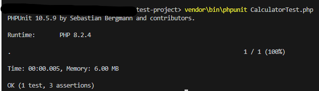

[Download This](https://getcomposer.org/)

[Read This](https://www.freecodecamp.org/news/test-php-code-with-phpunit/)

### 0 step : Install dependenceys
```bash
composer install
```

### 1 step : Update composer using
```bash
composer dump-autoload
```

### 2 step : Run Test
```bash
vendor\bin\phpunit test\CalculatorTest.php
```

### If faild
```bash
vendor/bin/phpunit
```

### Install pacakge
```bash
composer require --dev phpunit/phpunit
```


